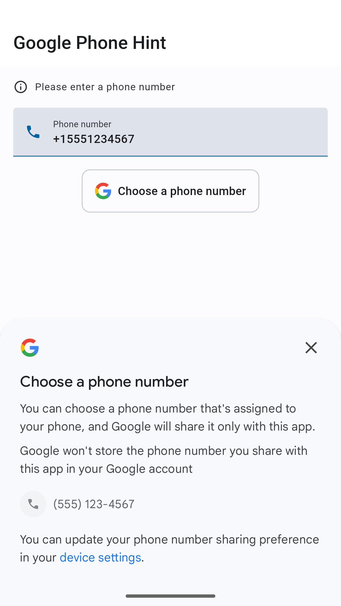
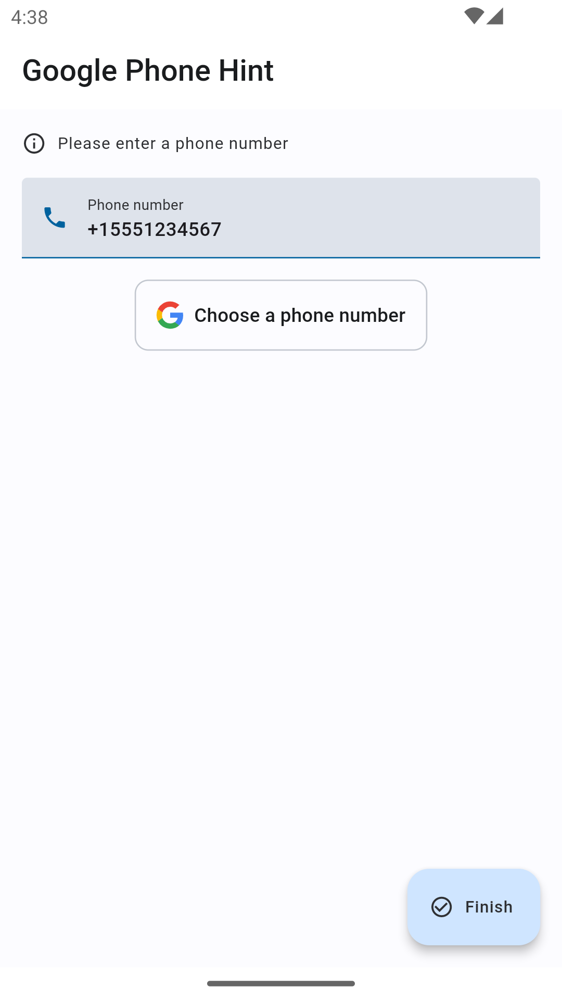

# Google Phone Number Hint Example
Decided to implement Google's phone number api with Flutter

## What I learned
* Using Flutter platform channels to call native Android API's 
* Google Phone Number Hint API
* Flutter Material 3 styling

## Screenshots

